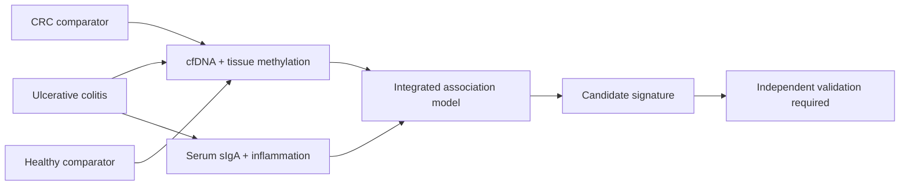

<div align="center">

# Methylation + sIgA

### Reading epigenetic and mucosal immune signals together in ulcerative colitis

[](https://sandrisper-rgb.github.io/methylation/)
[](https://quarto.org/)
[](https://github.com/sandrisper-rgb/methylation/actions/workflows/publish.yml)

**PCI-2024-0016 · Universidad El Bosque · InmuBo Cancer Research Line**

</div>

---

## The idea

Long-standing ulcerative colitis can create a cycle of inflammation, epithelial injury, and repair that increases the risk of colitis-associated colorectal cancer. This exploratory study asks whether two very different biological signals can be interpreted together:

- **DNA methylation** in plasma cell-free DNA and colonic tissue—an epigenetic view of gene regulation and cellular state.
- **Secretory immunoglobulin A (sIgA)** in serum—a complementary view of mucosal immune-barrier biology.

The aim is to characterize and compare these signals across ulcerative colitis, colorectal cancer, and healthy comparator groups, then test their relationships with inflammatory markers.



## What lives here

| Area | Purpose |
|---|---|
| [Study design](https://sandrisper-rgb.github.io/methylation/research.html) | Question, objectives, samples, methods, ethics, and analysis frame |
| [Methylation vs sIgA](https://sandrisper-rgb.github.io/methylation/approach.html) | Side-by-side comparison of the two biological approaches |
| [cfDNA technology](https://sandrisper-rgb.github.io/methylation/technology.html) | DELFI, GEMINI, CUHK, UCLA, Stanford, Galleri, Tagomics, and a practical technology ladder |
| [Project media](https://sandrisper-rgb.github.io/methylation/resources.html) | Embedded video, English PDF, and Spanish PowerPoint |
| [Related research](https://sandrisper-rgb.github.io/methylation/related-work.html) | IBD and biomarker programs at UCLA, Johns Hopkins, Stanford, CHU Sainte-Justine, and beyond |
| [`workflows/`](workflows/) | Reproducible analysis notebooks and documented decisions |
| [`findings/`](findings/) | Reviewed summaries as evidence develops |

## Planned comparison

The study materials describe **36 sample units**: plasma cfDNA and colonic tissue from high-risk ulcerative colitis, colorectal cancer, and healthy comparator groups. The public site deliberately distinguishes planned methods and expected results from completed evidence.

## Build locally

Install [Quarto](https://quarto.org/docs/get-started/) and run:

```bash
quarto preview
```

For a production build:

```bash
quarto render
```

Every push to `main` renders the site and deploys `_site` through GitHub Actions.

## Data governance

Do not commit participant-level clinical data, genomic data, identifiers, consent forms, or linkage keys. Public materials must remain de-identified and consistent with ethics approval, informed consent, institutional policy, and Colombian data-protection requirements.

## Research status

This repository communicates an **exploratory biomarker study**. It does not provide medical advice, a validated diagnostic test, or evidence that methylation or serum sIgA predicts an individual's cancer risk. Prognostic and clinical-utility claims require longitudinal, external validation.

## Team

- **Angie Alejandra Benavides Rojas** — M.Sc. student in Basic Biomedical Sciences
- **Dr. Sandra Perdomo** — Advisor
- **Dr. María Consuelo Romero** — Co-advisor

Universidad El Bosque · InmuBo Cancer Research Line
