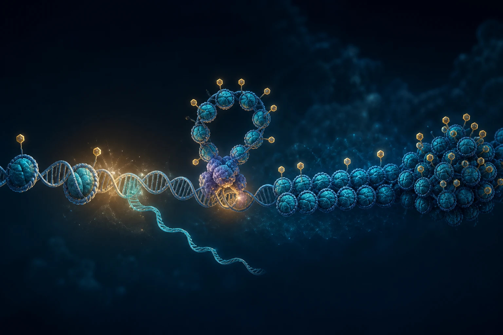
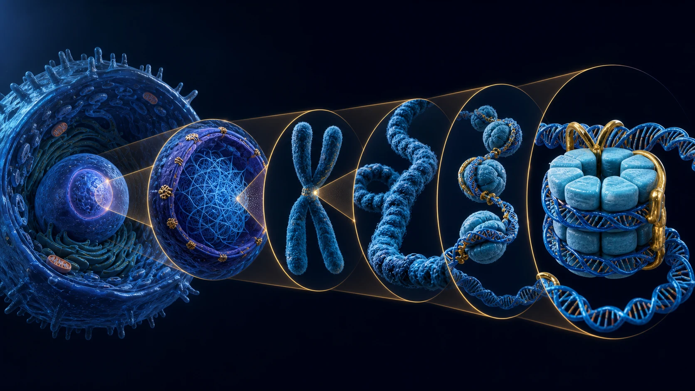

::: {.lead-panel}
## DNA is stored, but never simply put away

A typical nucleated human cell stores roughly **two metres of DNA** inside a nucleus only a few micrometres wide. Histones solve part of this packing problem: DNA winds around them to form nucleosomes. But the package is dynamic. A cell must continually expose the right regions for transcription, replication, and repair while keeping others protected.
:::

{.science-visual fig-alt="DNA wrapped around histones in open and compact chromatin, with methyl marks and an emerging RNA transcript"}

## First, get a feeling for the scale

Cells vary enormously, so there is no universal “average cell.” For a concrete mental model, use a **30 µm cell** with a **5 µm nucleus**, values in the range of many human cells. The DNA double helix is only about **2 nm wide**, yet the diploid nuclear genome contains roughly **6.4 billion base pairs** and would extend about **2.08 m** if pulled straight.

::: {.scale-metrics}
::: {.scale-metric}
**30 µm**

representative cell diameter
:::
::: {.scale-metric}
**5 µm**

representative nucleus diameter
:::
::: {.scale-metric}
**2 nm**

DNA double-helix diameter
:::
::: {.scale-metric}
**2.08 m**

DNA length per diploid nucleus
:::
:::

That is a length-to-container ratio of about **416,000:1**. If the nucleus were a **tennis ball 6.7 cm across**, its DNA would be approximately **28 km long**—while the scaled DNA strand would still be thinner than a fine thread.

### Try the scale explorer

Choose how large to make the 30 µm reference cell. The other dimensions update by the same factor.

::: {.scale-explorer #scale-explorer}
<label for="scale-model"><strong>Make the cell as wide as:</strong></label>
<select id="scale-model">
  <option value="real">its real size</option>
  <option value="human">a 1.7 m person</option>
  <option value="field">a 100 m football field</option>
  <option value="earth" selected>planet Earth</option>
</select>

<div class="scale-output" aria-live="polite">
  <div><span>Nucleus</span><strong id="scale-nucleus">≈ 2,124 km</strong><small id="scale-nucleus-note">close to Pluto's diameter</small></div>
  <div><span>DNA width</span><strong id="scale-width">≈ 850 m</strong><small>the helix itself</small></div>
  <div><span>One nucleosome</span><strong id="scale-nucleosome">≈ 4.7 km</strong><small>about 11 nm across in reality</small></div>
  <div><span>DNA stretched out</span><strong id="scale-length">≈ 883 million km</strong><small id="scale-length-note">past Jupiter's average orbit</small></div>
</div>
:::

<script>
(() => {
  const models = {
    real: { nucleus: "5 µm", width: "2 nm", nucleosome: "≈ 11 nm", length: "≈ 2.08 m", nucleusNote: "inside a representative 30 µm cell", lengthNote: "more than 400,000 nucleus diameters" },
    human: { nucleus: "≈ 28 cm", width: "≈ 0.11 mm", nucleosome: "≈ 0.62 mm", length: "≈ 118 km", nucleusNote: "about a large dinner plate", lengthNote: "roughly a long intercity drive" },
    field: { nucleus: "≈ 16.7 m", width: "≈ 6.7 mm", nucleosome: "≈ 3.7 cm", length: "≈ 6,933 km", nucleusNote: "about a five-storey building", lengthNote: "nearly Earth's radius" },
    earth: { nucleus: "≈ 2,124 km", width: "≈ 850 m", nucleosome: "≈ 4.7 km", length: "≈ 883 million km", nucleusNote: "close to Pluto's diameter", lengthNote: "past Jupiter's average orbit" }
  };
  const select = document.querySelector("#scale-model");
  if (!select) return;
  const update = () => {
    const m = models[select.value];
    document.querySelector("#scale-nucleus").textContent = m.nucleus;
    document.querySelector("#scale-width").textContent = m.width;
    document.querySelector("#scale-nucleosome").textContent = m.nucleosome;
    document.querySelector("#scale-length").textContent = m.length;
    document.querySelector("#scale-nucleus-note").textContent = m.nucleusNote;
    document.querySelector("#scale-length-note").textContent = m.lengthNote;
  };
  select.addEventListener("change", update);
  update();
})();
</script>

## A guided zoom: cell to DNA

::: {.annotated-science-figure}

<span class="figure-pin pin-1" aria-hidden="true">1</span>
<span class="figure-pin pin-2" aria-hidden="true">2</span>
<span class="figure-pin pin-3" aria-hidden="true">3</span>
<span class="figure-pin pin-4" aria-hidden="true">4</span>
<span class="figure-pin pin-5" aria-hidden="true">5</span>
:::

::: {.zoom-legend}
::: {.zoom-item}
**1 · Cell**

Membrane-bound living unit, tens of micrometres across.
:::
::: {.zoom-item}
**2 · Nucleus**

Genome-containing compartment, commonly 5–10 µm across.
:::
::: {.zoom-item}
**3 · Chromatin**

DNA, histones, and associated proteins organized in 3D.
:::
::: {.zoom-item}
**4 · Nucleosomes**

Repeated DNA–histone particles: the first packing level.
:::
::: {.zoom-item}
**5 · DNA**

A double helix only about 2 nm wide.
:::
:::

The illustration is annotated for orientation, but the objects are **not drawn to one common scale**—that would make the DNA invisible.

## The packing trick: DNA around protein spools

The core nucleosome contains eight histone proteins—two each of **H2A, H2B, H3, and H4**. About **147 DNA base pairs** wrap around that octamer approximately 1.7 times. Linker DNA connects one nucleosome to the next, producing the familiar “beads on a string.” Those fibers fold and interact at larger scales to form chromatin and, during cell division, highly condensed chromosomes.

{.science-visual fig-alt="Nested zoom from a cell and nucleus to a chromosome, chromatin fiber, nucleosomes, and DNA around a histone octamer"}

::: {.packing-animation role="img" aria-label="Animated DNA wrapping around a histone core to form a nucleosome"}
::: {.packing-dna}
:::
::: {.packing-core}
<span></span><span></span><span></span><span></span><span></span><span></span><span></span><span></span>
:::
::: {.packing-caption}
~147 base pairs · ~1.7 turns · 8 core histones
:::
:::

| Scale | What is happening | Why it matters |
|---|---|---|
| Cell → nucleus | The genome is contained in a protected compartment | The same DNA sequence is present in most cells, but access differs by cell type |
| Chromosome → chromatin | Long DNA molecules are folded into a spatially organized polymer | Distant enhancers and promoters can meet; other regions are segregated |
| Chromatin → nucleosome | DNA wraps around histone octamers | Packaging saves space and controls physical access to DNA |
| Nucleosome → DNA sequence | Local proteins move, unwrap, or modify nucleosomes | Transcription factors and polymerases can reach—or fail to reach—a gene |

## How much DNA is in one human?

A 2023 cell census estimated roughly **36 trillion cells** in a reference adult male, **28 trillion** in a reference adult female, and **17 trillion** in a 10-year-old child. These are models, not exact counts for every person. Cell type and body size matter enormously.

Crucially, not every cell carries nuclear DNA. Mature red blood cells account for most cells by number and have expelled their nuclei; platelets are cell fragments. Using the census's approximate **7 trillion nucleated cells** for a reference adult male:

$$7\times10^{12}\ \text{nucleated cells}\times2.08\ \text{m DNA per nucleus}
\approx1.46\times10^{13}\ \text{m}$$

That is roughly **14.6 billion km** of nuclear DNA: about **98 Earth–Sun distances**, **38,000 Earth–Moon distances**, or more than **three trips from the Sun to Neptune**. It is an order-of-magnitude thought experiment: some cells are polyploid or multinucleated, germ cells are haploid, cells occupy different cell-cycle states, and mitochondrial DNA is not included.

::: {.human-dna-orbit role="img" aria-label="Animated comparison of estimated DNA length in a human with Earth, Moon, Sun, and Neptune distances"}
::: {.orbit-sun}
Sun
:::
::: {.orbit-earth}
Earth
:::
::: {.orbit-neptune}
Neptune
:::
::: {.orbit-path}
:::
::: {.orbit-copy}
**≈14.6 billion km of nuclear DNA**

Illustrative reference adult male · ≈7 trillion nucleated cells
:::
:::

## Histones are also control surfaces

Histone tails extend from the nucleosome and can receive chemical modifications. **Acetylation** often weakens chromatin compaction and accompanies accessible, transcriptionally active regions. Removing acetyl groups can support a more compact state. **Histone methylation** is more context-dependent: its effect depends on which amino acid is modified and how many methyl groups are added. It can mark either active or repressed chromatin.

That distinction matters: **DNA methylation at a CpG is not the same thing as histone methylation.** One modifies cytosine in DNA; the other modifies amino acids in histone proteins.

## How CpGs can influence the histone package

CpG methylation does not physically “methylate a histone.” Instead, the two systems communicate through proteins that read and remodel chromatin.

```{mermaid}
flowchart LR
  A["CpG-rich promoter<br/>becomes methylated"] --> B["Some transcription factors<br/>bind less efficiently"]
  A --> C["Methyl-CpG reader proteins<br/>bind the DNA"]
  C --> D["HDAC and chromatin-remodelling<br/>complexes are recruited"]
  B --> E["Promoter becomes<br/>less accessible"]
  D --> E
  E --> F["Transcription often decreases"]
```

At some promoters, dense CpG methylation can block particular transcription factors or recruit methyl-CpG-binding proteins. Those readers can bring histone deacetylases and chromatin-remodelling complexes to the region. Nucleosomes may then become more stable or compact, making it harder to assemble the transcription machinery. The result can be lower gene expression.

::: {.callout-warning title="Methylation does not always mean silence"}
Promoter methylation near a transcription start site is the clearest context for repression. Methylation inside an actively transcribed gene body can coexist with expression, and enhancer or intergenic methylation has context-specific effects. A methylated CpG alone is therefore not proof that its nearest gene is off.
:::

## What this study can—and cannot—observe

EM-seq measures protected modified cytosines at single-base resolution. It can reveal whether CpGs in a promoter, gene body, enhancer, or other region differ between colitis, colorectal-cancer, and healthy-comparator samples. Standard EM-seq generally reads **5mC and 5hmC together**, so the signal should not automatically be called pure 5mC.

The assay does **not** directly measure histone proteins, histone-tail modifications, chromatin accessibility, or RNA expression. Those would require assays such as ChIP-seq/CUT&Tag, ATAC-seq, or RNA-seq. Plasma fragment lengths and genomic end positions may carry indirect nucleosome footprints, but they remain inference—not a histone measurement. Tissue DNA is deliberately sheared, so its insert lengths cannot be interpreted as native chromatin footprints.

::: {.callout-important title="The useful interpretation"}
A promoter DMR is strongest when several neighboring CpGs change coherently, the effect survives coverage and cell-mixture checks, and RNA or protein measurements move in the expected direction. EM-seq supplies the methylation layer; the proposed histone-and-expression mechanism remains a testable explanation until those other layers are measured.
:::

[Tour cell dimensions](https://nigms.nih.gov/biobeat/2021/03/take-a-tour-of-your-cells-organelles) · [Read the 2023 human-cell census](https://doi.org/10.1073/pnas.2303077120) · [See the astronomical calculation](https://doi.org/10.1080/29932203.2026.2668244) · [Explore DNA packaging](https://www.ncbi.nlm.nih.gov/books/NBK26834/) · [Review methylation by genomic context](https://doi.org/10.1038/nrg3230) · [Read about methylation–histone crosstalk](https://pmc.ncbi.nlm.nih.gov/articles/PMC6611551/)

[How EM-seq reads methylation →](what-is-emseq.qmd) · [Why cfDNA fragments reflect chromatin →](what-is-fragmentomics.qmd) · [Follow the sequencing workflow →](../sequencing-methods.qmd)
