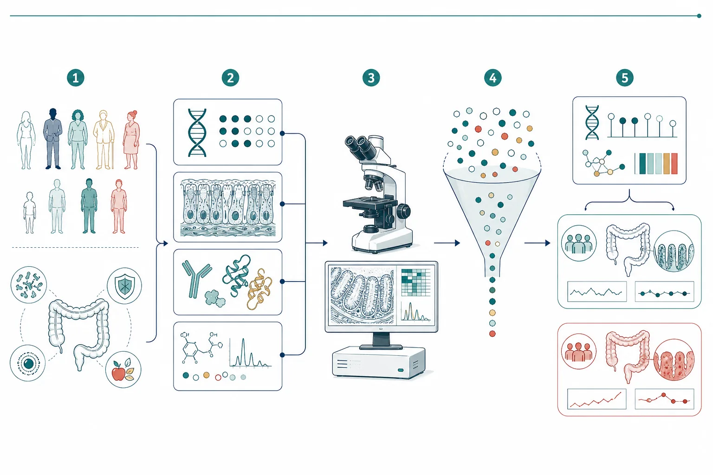

{.science-visual fig-alt="A dense field of genes, proteins, metabolites, and molecular measurements passes through a selection funnel to become a compact molecular fingerprint"}

::: {.callout-note title="Cross-post"}
This article was originally published on the [Project Delphi ML Blog](https://project-delphi.github.io/ml-blog/posts/what-is-a-biological-signature/).
:::

::: {.lead-panel}
A **signature** is a short list of measured molecular features (genes, proteins,
or metabolites) that distinguishes one condition from another.
:::

It is feature selection on wide, small-$n$ data: tens of thousands of genes,
tens of patients. A model given all features will fit noise.

<figure class="signature-figure column-page" aria-label="A large cloud of measured biological features passes through a selection funnel and becomes a compact five-feature signature">

Measure wide

<strong>screen · penalize · resample</strong>

Keep the stable signal

Gene 04

CpG 17

Protein 09

Gene 31

Metabolite 06

<figcaption>Feature selection is compression with a biological purpose: reduce thousands of measurements to a small panel without throwing away the distinction that matters.</figcaption>
</figure>

## Procedure

1. **Measure wide.** Every feature on every sample.
2. **Find the groups.** Use known labels, or let clustering propose groups.
3. **Select.** Score features by group separation:
   - *$t$-test:* distance between group means relative to within-group scatter.
   - *Mutual information:* how much the feature tells you about group membership.
   - *Penalized models* (lasso, elastic net): drop features by charging a cost
     for each one used.
4. **Validate on held-out data.** Redo selection **inside** each
   cross-validation fold.

Selecting on all samples, then testing on a "held-out" subset, leaks the
selection. [Ambroise and McLachlan (2002)](https://doi.org/10.1073/pnas.102102699)
showed that this bias drives reported error toward zero; nested selection raises
it again.

<figure class="signature-figure column-page" aria-label="Comparison of leaky and honest validation workflows">

<h3>Leaky validation</h3>

All samples

→

Select features

→

Cross-validate

<strong>Too optimistic:</strong> the held-out samples already influenced which features were chosen.

<h3>Honest validation</h3>

Training fold

→

Select features

→

Held-out fold

<strong>Defensible:</strong> every fold repeats selection before the untouched samples are evaluated.

<figcaption>The held-out fold must remain invisible to every outcome-informed step—not only model fitting, but also feature screening, tuning, scaling, and imputation.</figcaption>
</figure>

## Canonical example: Golub leukemia

ALL and AML are two acute leukemias that look similar under a microscope and
take opposite chemotherapies. Diagnosis used to rest on four specialist lab
tests.

[Golub et al. (1999)](https://doi.org/10.1126/science.286.5439.531) measured
6,817 genes in 38 acute-leukemia samples.

- Unsupervised clustering, given no disease labels, nearly recovered the split
  (one group 24 ALL + 1 AML; the other 10 AML + 3 ALL).
- A 50-gene predictor was then tested on 34 independent samples from other
  banks.

Fifty features out of 6,817 is a signature.

<strong>6,817</strong>genes measured in the discovery experiment

<strong>50</strong>genes retained in the predictive signature

<strong>34</strong>fresh samples used for independent testing

The same four steps apply to environmental DNA (a few marker sequences implying
a species was present) and to exoplanet spectra (gases inconsistent with
abiotic chemistry).

## References

- Ambroise, C. & McLachlan, G. J. (2002). [Selection bias in gene extraction on
  the basis of microarray gene-expression data](https://doi.org/10.1073/pnas.102102699).
  *PNAS*.
- Golub, T. R. et al. (1999). [Molecular classification of cancer: class
  discovery and class prediction by gene expression
  monitoring](https://doi.org/10.1126/science.286.5439.531).
  *Science* 286(5439):531–537.
- Guyon, I. & Elisseeff, A. (2003). [An introduction to variable and feature
  selection](https://www.jmlr.org/papers/v3/guyon03a.html). *JMLR*.
- Meinshausen, N. & Bühlmann, P. (2010). [Stability
  selection](https://doi.org/10.1111/j.1467-9868.2010.00740.x). *JRSS-B*.
