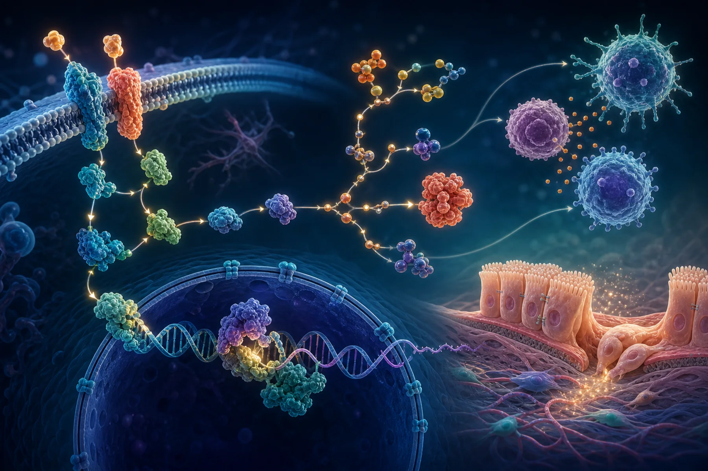

::: {.lead-panel}
## A map, not a measurement

The **Kyoto Encyclopedia of Genes and Genomes (KEGG)** organizes genes, proteins, metabolites, diseases, and drugs into manually drawn pathway maps. It helps researchers ask whether a result list contains more members of a known biological system than expected by chance. KEGG does not measure pathway activity and does not prove that a pathway causes disease.
:::

{.science-visual fig-alt="Scientific pathway illustration connecting membrane receptors, signaling proteins, nuclear gene regulation, immune cells, and epithelial tissue"}

## What a KEGG pathway contains

A [KEGG PATHWAY](https://www.genome.jp/kegg/pathway.html) map is a network of molecular interactions, reactions, and processes. Broad collections include metabolism, genetic and environmental information processing, cellular processes, organismal systems, human diseases, and drug development. Organism-specific identifiers connect human genes to these maps.

```{mermaid}
flowchart LR
  D["FDR-controlled<br/>DMRs"] --> A["Map regions to genes<br/>with explicit rules"]
  A --> L["Candidate gene list"]
  U["Genes linked to all<br/>regions actually tested"] --> E["KEGG enrichment test"]
  L --> E
  E --> R["Pathway overlap<br/>effect + adjusted p-value"]
  R --> I["Biological hypothesis<br/>for validation"]
```

## How enrichment works

Over-representation analysis compares two proportions: the fraction of candidate genes belonging to a pathway and the fraction in a relevant **background universe**. A hypergeometric or Fisher exact test is common, followed by false-discovery-rate correction across pathways. Ranked-list methods such as gene-set enrichment analysis can instead test whether a pathway's genes accumulate toward one end of an ordered statistic.

The background matters enormously. For this study it should represent genes that could have been discovered after coverage, filtering, and region-to-gene mapping—not every human gene. Using the whole genome can make enrichment appear stronger simply because many genes were never testable.

## How KEGG helps this study

After coverage-aware DML/DMR analysis, KEGG can organize candidate genes into interpretable systems potentially related to:

- inflammatory and immune signaling;
- epithelial integrity and cell adhesion;
- apoptosis, cell cycle, and DNA repair;
- host–microbe interactions; and
- colorectal tumor biology.

These labels are prompts for biological follow-up. A methylated promoter near a pathway gene does not automatically mean the gene is less expressed; the effect depends on genomic context, cell mixture, direction, and functional evidence.

## What should be reported

| Item | Why readers need it |
|---|---|
| KEGG release or access date | Pathway membership changes over time |
| Genome build and identifier conversion | Prevents silent coordinate/gene mismatches |
| CpG/DMR-to-gene rule | One region may map to several genes—or none |
| Tested-feature background | Defines the actual null comparison |
| Overlap genes and counts | Shows what produced the pathway result |
| Effect measure and adjusted p-value | Separates magnitude from multiplicity |
| Direction of methylation change | Avoids mixing hyper- and hypomethylated biology |

In R, [`clusterProfiler`](https://bioconductor.org/packages/clusterProfiler/) provides transparent KEGG enrichment workflows. Reproducibility still depends on saving identifiers, inputs, parameters, software version, and database date. Users should also check [KEGG's database and licensing information](https://www.kegg.jp/kegg/legal.html) for the intended access and reuse.

::: {.callout-important title="Bottom line"}
KEGG converts a statistically supported gene list into a structured biological question. It is strongest when the gene-mapping rule, tested background, overlap, and uncertainty are visible—and weakest when a colorful pathway name is treated as proof of mechanism.
:::

[Compare Reactome →](what-is-reactome.qmd) · [See the statistical workflow →](statistical-analysis-of-methylation-data.qmd) · [Read the software guide →](how-methylation-software-evolved.qmd)
