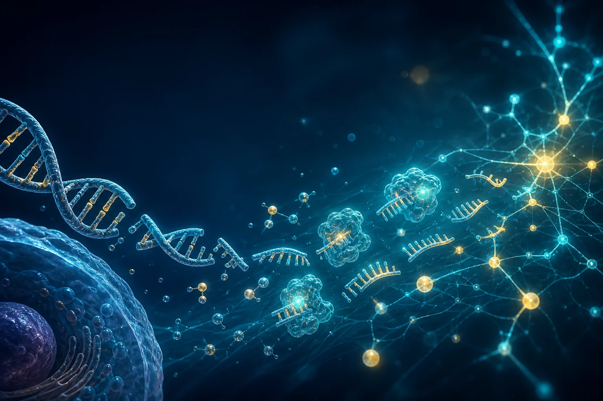
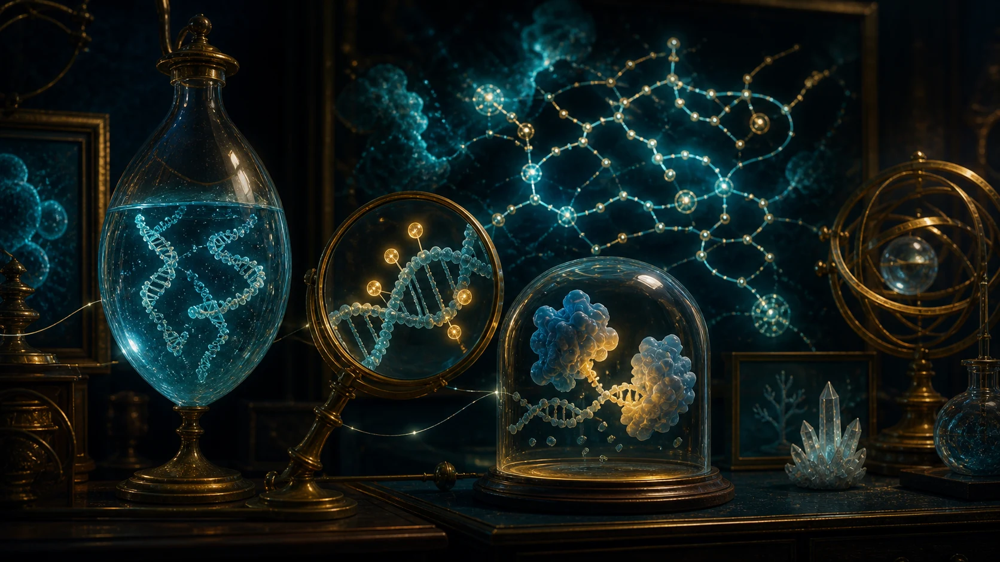

::: {.lead-panel}
## Five names, five different kinds of history

Some scientific terms describe an object, others a chemical change, a field, a method, or a database. Knowing which is which makes the vocabulary much easier to remember.
:::

{.science-visual fig-alt="Conceptual scientific illustration of DNA, methyl groups, DNA fragments, enzymes, and a pathway network"}

| Term | Literally | Where the name came from | What it means here |
|---|---|---|---|
| **cfDNA** | **c**ell-**f**ree DNA | A plain description: DNA found outside intact cells. Mandel and Métais reported nucleic acids in human blood in 1948. | Short DNA molecules circulating in plasma; only a fraction may come from diseased tissue. |
| **Methylation** | Addition of a **methyl** group, $\mathrm{-CH_3}$ | A chemistry term, not a genomics brand. In 1948 Rollin Hotchkiss detected 5-methylcytosine in animal DNA and called the unexpected spot “epicytosine.” | A chemical layer on DNA, commonly measured at cytosines in CpG sites. |
| **Fragmentomics** | **Fragment** + **-omics** | Built in the style of *genomics* and *proteomics*: study the fragment population as a system. The name became established as cfDNA length, end, and genome-wide cleavage patterns emerged as biomarkers in the 2010s. | Reading the size, ends, motifs, and genomic positions of cfDNA—not just its sequence. |
| **EM-seq** | **E**nzymatic **M**ethyl-seq | A method name for enzymatic methyl sequencing, introduced as a gentler alternative to bisulfite conversion and described in 2021. | Enzymes distinguish modified from unmodified cytosines before sequencing, helping preserve scarce cfDNA. |
| **Reactome** | A name centered on biological **reactions** | The open pathway project was founded in 2003. Its reaction-first organization distinguishes it from a simple list of genes. | A curated map used to ask which biological reactions and pathways are represented by a result set. |

{.science-visual .science-visual-compact fig-alt="Imaginative museum display containing DNA fragments, methylated DNA, molecular enzymes, and a reaction network"}

::: {.callout-tip title="A quick memory trick"}
**cfDNA is the material; methylation is a mark; fragmentomics is a way of reading molecule shape; EM-seq is a laboratory method; Reactome is a knowledgebase for interpretation.**
:::

The dates mark early reports or project milestones—not the moment each modern meaning appeared fully formed. Scientific vocabulary usually settles gradually as methods and communities develop.

[Explore the cfDNA history](https://pmc.ncbi.nlm.nih.gov/articles/PMC9139999/) · [See the landmark 2019 fragmentation study](https://doi.org/10.1038/s41586-019-1272-6) · [Read the EM-seq paper](https://doi.org/10.1186/s13059-021-02353-6) · [Visit Reactome](https://reactome.org/what-is-reactome/)

[What is fragmentomics? →](what-is-fragmentomics.qmd) · [What is EM-seq? →](what-is-emseq.qmd) · [What is Reactome? →](what-is-reactome.qmd)
