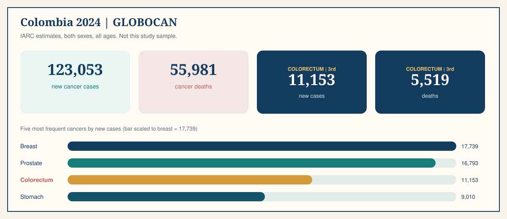

## Thirty minutes, five acts

::: {.lang-switch}
[English](new-joiner-en.qmd){.is-on} [Español](new-joiner-es.qmd)
:::

::: {.split}
::: {.visual}
{fig-alt="Plasma, tissue, and sIgA streams converging on one participant profile"}
:::
::: {.copy}
<p class="lede">English-only briefing for new joiners. Gene names, enzymes, and software stay in their published form. Press `s` for timed notes. After each check, say the answer before you click.</p>

::: {.card .card-teal}
<h3>The hour</h3>

1. Clinical problem — 6 min
2. Two molecular languages — 8 min
3. This study — 5 min
4. Lab and software — 8 min
5. How you start — 3 min
:::

::: {.pause}
Pause 20 seconds: who is wet-lab, who is computational, who is both?
:::
:::
:::

::: notes
Ask the room split. 1 min.
:::

## Colombia, 2024: the cancer backdrop {background-image="../media/illustrations/colitis-colon-cancer-clinical.webp" background-opacity="0.08"}

<span class="clock">2 min</span>
<p class="kicker">Act 1 · Clinical problem</p>

{.plate fig-alt="GLOBOCAN 2024 Colombia cancer counts with colorectal cancer highlighted"}

<p class="lede">IARC estimates, both sexes, all ages. These are national figures, not this project's sample. They explain why a Colombian colitis–CRC study exists.</p>

::: notes
Do not present these as study results. Source: IARC Colombia fact sheet 2024.
:::

## Ulcerative colitis is mucosal, chronic, and not Crohn's

::: {.split}
::: {.visual}
{fig-alt="Illustrative views of healthy mucosa, ulcerative colitis, and colorectal cancer"}
:::
::: {.copy}
<p class="lede"><strong>Ulcerative colitis (UC)</strong> is chronic inflammation of the colonic mucosa. Blood in stool, diarrhea, urgency, and abdominal pain are common. Extent and activity vary.</p>

::: {.card .card-teal}
<h3>What it is</h3>

Continuous mucosal inflammation starting from the rectum in typical disease. Relapsing course.
:::

::: {.card .card-coral}
<h3>What it is not</h3>

Not Crohn's. This protocol excludes Crohn's, prior colonic surgery, and contraindication to colonoscopy or biopsy.
:::

::: {.card .card-gold}
<h3>Why eight years appears</h3>

AGA/ECCO surveillance often starts ~8–10 years after onset, or earlier with primary sclerosing cholangitis. That is a **surveillance threshold**, not a clock that says cancer arrives at year eight.
:::
:::
:::

## Progression is possible. It is not the default path.

::: {.split .split-wide}
::: {.visual}
{.plate fig-alt="Four stages: UC, persistent inflammation, dysplasia, colitis-associated CRC"}
:::
::: {.copy}
<p class="lede">Most people with UC never enter dysplasia or colitis-associated CRC. Colonoscopic surveillance remains the clinical backbone. This project does not replace it. It asks whether blood and tissue molecules add a second, biological layer.</p>

::: {.card .card-ocean}
<h3>The research layer</h3>

Paired plasma cfDNA, colonic tissue methylation, and serum sIgA — read together, not as a diagnostic test.
:::
:::
:::

::: notes
90 seconds. Most patients never reach panel 4.
:::

## Check 1

::: {.split}
::: {.visual}
{fig-alt="Colon views used as a prompt for the first check"}
:::
::: {.copy}
::: {.check}
<p class="check-q">Most people with ulcerative colitis develop colorectal cancer.</p>

::: {.check-options}
::: {.opt}
A · True
:::
::: {.opt}
B · False
:::
:::
:::

::: {.fragment .answer .answer-no}
**False.** Long-standing extensive UC raises risk. Most patients never enter dysplasia or colitis-associated CRC. Surveillance exists because cancer is possible, not because it is typical.
:::
:::
:::

## DNA methylation is a chemical mark, not a mutation

<span class="clock">3 min</span>
<p class="kicker">Act 2 · Two molecular languages</p>

::: {.split .split-wide}
::: {.visual}
{.plate fig-alt="Accessible promoter versus hypermethylated promoter with CH3 marks"}
:::
::: {.copy}
<p class="lede">A sequencer reads **C** whether or not a methyl group is attached. The biology lives in that extra mark: **5-methylcytosine (5mC)**, usually at a **CpG** (cytosine then guanine on the same strand).</p>

::: {.chip-row}
<span class="chip">hypermethylation = more 5mC</span>
<span class="chip">hypomethylation = less 5mC</span>
<span class="chip">silenced = promoter 5mC + low RNA, measured together</span>
:::

{.plate-photo fig-alt="DNA packing inside a cell nucleus"}
:::
:::

## Candidate genes are hypotheses, not the disease

::: {.split}
::: {.visual}
{fig-alt="Immune, epithelial, and gene-regulatory pathways drawn as a network"}
:::
::: {.copy}
{.plate fig-alt="FAM217B, KIAA1614, RIBC2 panel and hypomethylated immune genes"}

::: {.card .card-ocean}
<h3>Also around UC neoplasia</h3>

`CDKN2A` / p16, `CDH1` (E-cadherin), `FOXE1` / `SYNE1`.
:::

::: {.card .card-coral}
<h3>How this project must test them</h3>

Keep methylated and total counts. Use DSS. Require coherent CpGs in a region. Compare tissue with paired plasma. Adjust for inflammation and cell mixture.
:::
:::
:::

## Secretory IgA is a mucosal border antibody

::: {.split}
::: {.visual}
{fig-alt="Intestinal epithelium, secretory IgA, serum droplet, and ELISA wells"}
:::
::: {.copy}
<p class="lede"><strong>sIgA</strong> binds microbes and antigens at wet surfaces and limits epithelial contact without turning every encounter into inflammation.</p>

<p class="lede">This study measures **serum sIgA by ELISA**, calibration 1.250–0 µg/ml in the presented run ($R^2=0.959$). That $R^2$ is assay development, not plate acceptance. Blanks, recovery, replicate CV, LLOQ/ULOQ, and parallelism still decide if a number is usable.</p>

::: {.rule}
Serum is not stool, not mucus, not luminal coating. Do not report a serum value as intestinal secretion.
:::
:::
:::

## The two signals answer different questions

::: {.split}
::: {.visual}
{fig-alt="Methylation, fragmentation, immune, and statistical signals converging into a fingerprint"}
:::
::: {.copy}
::: {.card .card-teal}
<h3>DNA methylation</h3>

Epigenetic state and cell identity. Plasma cfDNA + colonic tissue. CpG/region readout. High-dimensional. Fails under batch, cell mixture, and mixed tissue of origin.
:::

::: {.card .card-gold}
<h3>Serum sIgA</h3>

Mucosal humoral immunity. Serum ELISA concentration. One interpretable number. Fails under infection, drugs, systemic production, and clearance.
:::

<p class="lede">Integration tests whether the **joint pattern** separates UC, CRC, and healthy groups better than either marker alone. That is still association, not a diagnostic test.</p>
:::
:::

## Check 2

::: {.split}
::: {.visual}
{fig-alt="Three data streams from one participant"}
:::
::: {.copy}
::: {.check}
<p class="check-q">Match the measurement to the specimen.</p>

::: {.check-options}
::: {.opt}
A · Plasma EM-seq reads serum sIgA concentration.
:::
::: {.opt}
B · Tissue DNA is left unsheared so fragmentomics of the colon can be read.
:::
::: {.opt}
C · Plasma cfDNA methylation, tissue methylation, and serum ELISA sIgA come from one participant.
:::
:::
:::

::: {.fragment .answer .answer-yes}
**C.** EM-seq is DNA chemistry, not an antibody assay. Tissue DNA is **intentionally sheared**; only native plasma fragments can support fragmentomics.
:::
:::
:::

## The question this grant is built to ask

<span class="clock">2 min</span>
<p class="kicker">Act 3 · This study</p>

::: {.split}
::: {.visual}
{fig-alt="Colonic tissue and plasma cfDNA paired in one participant"}
:::
::: {.copy}
<p class="lede">Can differential methylation in **plasma cfDNA** and **colonic tissue**, read together with **serum sIgA** and inflammation markers, help characterize high-risk UC relative to CRC and healthy comparators?</p>

::: {.metric-row}
::: {.metric}
**PCI-2024-0016**
<span>project code</span>
:::
::: {.metric}
**18**
<span>consented participants</span>
:::
::: {.metric}
**36**
<span>paired DNA specimens</span>
:::
::: {.metric}
**3**
<span>clinical groups</span>
:::
:::

<p class="lede">Operational lead: **Angie Alejandra Benavides Rojas**. Advisor: **Dr. Sandra Perdomo**. Co-advisor: **Dr. María Consuelo Romero**. Group: **InMubo**.</p>
:::
:::

## Pairing is within a person, not between groups

::: {.split .split-wide}
::: {.visual}
{.plate fig-alt="Eight UC, five CRC, and five healthy participants with paired plasma, tissue, and serum"}
:::
::: {.copy}
<p class="lede">UC eligibility: confirmed UC **>8 years** or **primary sclerosing cholangitis**. Sites: Cobos Medical Center, HIC Bucaramanga, GastroAdvanced.</p>

<p class="lede">Ethics: Colombian **Resolution 8430 of 1993**; HIC Bucaramanga–Fundación Cardiovascular committee **Minutes 005-2024**. Public git stays de-identified. No participant-level clinical or genomic data in this repository.</p>

{.plate-photo fig-alt="Tissue and plasma methylation connected as a bridge"}
:::
:::

## What this design can claim — and what it cannot

::: {.split}
::: {.visual}
{fig-alt="Signals entering an analysis fingerprint"}
:::
::: {.copy}
::: {.claims}
::: {.claim .claim-1 .claim-now}
**1 · Association**
<p>Signals vary together in these 18 people. This design can test that.</p>
:::
::: {.claim .claim-2 .claim-now}
**2 · Discrimination**
<p>A model separates predefined groups in held-out data — only with locked features and honest resampling.</p>
:::
::: {.claim .claim-3}
**3 · Prognosis**
<p>Predicts future progression. Needs longitudinal follow-up. Not this cross-section.</p>
:::
::: {.claim .claim-4}
**4 · Clinical utility**
<p>Using the model improves care versus colonoscopic surveillance. Not in scope.</p>
:::
:::
:::
:::

::: notes
This study lives on rungs 1–2.
:::

## Blood, biopsy, enzymes, sequencer, plate

<span class="clock">3 min</span>
<p class="kicker">Act 4 · Tools</p>

::: {.split .split-wide}
::: {.visual}
{.plate fig-alt="Path from blood and biopsy through PANAMAX, EM-seq, NovaSeq, and ELISA"}
:::
::: {.copy}
| Stage | Instrument | Stop/go |
|---|---|---|
| Plasma cfDNA | PANAMAX 48 | Yield without group-biased failure? |
| Tissue gDNA | PANAMAX 48 → UltraShear | Fragmentation documented? |
| Methylome library | NEBNext EM-seq | Conversion controls pass? |
| Sequencing | NovaSeq 6000, paired-end | Depth and identity usable? |
| sIgA | Serum ELISA | Replicates in range? |

{.plate-photo fig-alt="Nucleosomes through EM-seq to paired reads"}
:::
:::

::: notes
Plasma is not sheared. Tissue is.
:::

## Why EM-seq instead of bisulfite

::: {.split}
::: {.visual}
{fig-alt="Enzymatic methyl sequencing from nucleosome-protected DNA"}
:::
::: {.copy}
{.plate fig-alt="EM-seq: protect with TET2 and T4-BGT, convert with APOBEC, read C versus T"}

<p class="lede">Bisulfite converts unmodified cytosines but damages DNA. Plasma cfDNA is already scarce and short. EM-seq uses **TET2 + T4-BGT** to protect 5mC/5hmC, then **APOBEC** to deaminate unmodified C, which sequences as T.</p>

::: {.rule}
Standard EM-seq reports 5mC and 5hmC **together**. Write "modified cytosine" unless a second assay splits them.
:::
:::
:::

## Fragmentomics is a second layer on the same plasma library

::: {.split}
::: {.visual}
{fig-alt="Nucleosome-protected cfDNA fragments and paired-end reads"}
:::
::: {.copy}
{.plate fig-alt="Histone-wrapped DNA cut at linker regions, mono-nucleosomal mode near 167 bp"}

<p class="lede">From one paired-end plasma BAM you may recover fragment **length**, **ends**, **end motifs**, and **regional coverage**. Histones are not sequenced; packing is inferred.</p>

<p class="lede">This is a **feasibility extension**. It dies if plasma was sheared, insert sizes were not retained, depth is too low, or conversion bias is uncontrolled.</p>
:::
:::

## From FASTQ to a region you can name

::: {.split}
::: {.visual}
{fig-alt="Count-aware methylation analysis illustration"}
:::
::: {.copy}
{.plate fig-alt="fastp, bwa-meth, MethylDackel, DSS, KEGG/Reactome, integration"}

<p class="lede">At one CpG the data are methylated reads $M$ out of informative reads $N$. 50% of 2 reads is not 50% of 100. **DSS** uses a beta-binomial model, then joins neighboring CpGs into **DMRs**.</p>

::: {.card .card-gold}
<h3>Interpretation limit</h3>

KEGG/Reactome enrichment is a structured hypothesis. Record mapping rule, background universe, database version, and FDR.
:::
:::
:::

## Check 3

::: {.split}
::: {.visual}
{fig-alt="Software stack for a methylation–fragmentomics fingerprint"}
:::
::: {.copy}
::: {.check}
<p class="check-q">With 18 participants, the defensible near-term product is:</p>

::: {.check-options}
::: {.opt}
A · A clinical classifier that predicts UC→CRC for a new patient.
:::
::: {.opt}
B · A quality-controlled feasibility analysis and a small locked set of candidate features.
:::
::: {.opt}
C · A Galleri-style multi-cancer blood test for Colombia.
:::
:::
:::

::: {.fragment .answer .answer-yes}
**B.** High-dimensional classifiers, prognosis, and clinical use need independent longitudinal validation. Galleri is not validated for UC progression surveillance.
:::
:::
:::

## Your first week in this repository

<span class="clock">2 min</span>
<p class="kicker">Act 5 · How you start</p>

::: {.split}
::: {.visual}
{fig-alt="Evolution of methylation analysis software"}
:::
::: {.copy}
```bash
python3 -m venv .venv && source .venv/bin/activate
python -m pip install -r requirements-quarto.txt
python -m ipykernel install --user --name project-python \
  --display-name "Python (methylation project)"
quarto preview
```

<p class="lede">The kernel name `project-python` is required even for prose-only pages.</p>

::: {.card .card-coral}
<h3>Do not commit</h3>

Participant-level clinical or genomic data, identifiers, consent forms, linkage keys.
:::

::: {.card .card-teal}
<h3>Freeze contract</h3>

After any edit to an R document, re-render locally and commit `_freeze/`. CI has no R packages.
:::
:::
:::

## Done today means a candidate signature, not a test {background-image="../media/illustrations/tissue-plasma-pairing.webp" background-opacity="0.12"}

::: {.split}
::: {.visual}
{fig-alt="Pathway illustration for the close"}
:::
::: {.copy}
<p class="lede">Read, in this order: [study design](../research.qmd), [EM-seq](../posts/what-is-emseq.qmd), [sIgA](../posts/what-is-siga.qmd), [three data streams](../posts/three-data-streams-one-study.qmd), [candidate genes](../posts/silenced-and-inflammatory-genes-in-colitis.qmd), [statistics](../posts/statistical-analysis-of-methylation-data.qmd), [contribute](../contributing.qmd).</p>

<p class="lede">Then take the [30-question quiz](../quiz.qmd).</p>

::: {.pause}
Closing line: this is a candidate epigenetic–immune signature with transparent uncertainty — not a diagnostic test.
:::
:::
:::

## Appendix · Protocol chain {visibility="uncounted"}

::: {.split}
::: {.visual}
{fig-alt="Alignment and integration across the genomics pipeline"}
:::
::: {.copy}
::: {.small-list}
1. [Cohort and consent](../posts/protocol-cohort-and-consent.qmd)
2. [Blood processing](../posts/protocol-blood-processing.qmd)
3. [Colonic biopsy](../posts/protocol-colonic-biopsy-preparation.qmd)
4. [PANAMAX cfDNA](../posts/protocol-panamax-cfdna.qmd)
5. [PANAMAX genomic DNA](../posts/protocol-panamax-genomic-dna.qmd)
6. [UltraShear](../posts/protocol-ultrashear-fragmentation.qmd)
7. [EM-seq libraries](../posts/protocol-emseq-library-preparation.qmd)
8. [NovaSeq 6000](../posts/protocol-novaseq-6000.qmd)
9. [sIgA ELISA](../posts/protocol-siga-elisa.qmd)
:::
:::
:::
