## Treinta minutos, cinco actos

::: {.lang-switch}
[English](new-joiner-en.qmd) [Español](new-joiner-es.qmd){.is-on}
:::

::: {.split}
::: {.visual}
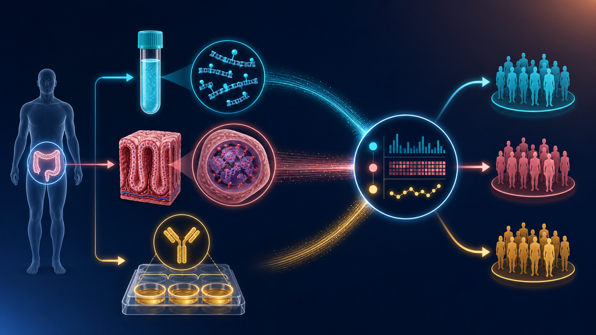{fig-alt="Tres corrientes de datos — plasma, tejido y sIgA — convergen en un perfil por participante"}
:::
::: {.copy}
<p class="lede">Briefing solo en español para quienes se incorporan. Los nombres de genes, enzimas y programas se quedan como en las publicaciones. Pulsa `s` para las notas con tiempos. Después de cada comprobación, di la respuesta antes de hacer clic.</p>

::: {.card .card-teal}
<h3>La hora</h3>

1. Problema clínico — 6 min
2. Dos lenguajes moleculares — 8 min
3. Este estudio — 5 min
4. Laboratorio y software — 8 min
5. Cómo empezar — 3 min
:::

::: {.pause}
Pausa de 20 segundos: ¿quién es de laboratorio húmedo, quién es computacional, quién es ambas cosas?
:::
:::
:::

::: notes
Pregunta el reparto de la sala. 1 min.
:::

## Colombia, 2024: el panorama del cáncer {background-image="../media/illustrations/colitis-colon-cancer-clinical.webp" background-opacity="0.08"}

<span class="clock">2 min</span>
<p class="kicker">Acto 1 · Problema clínico</p>

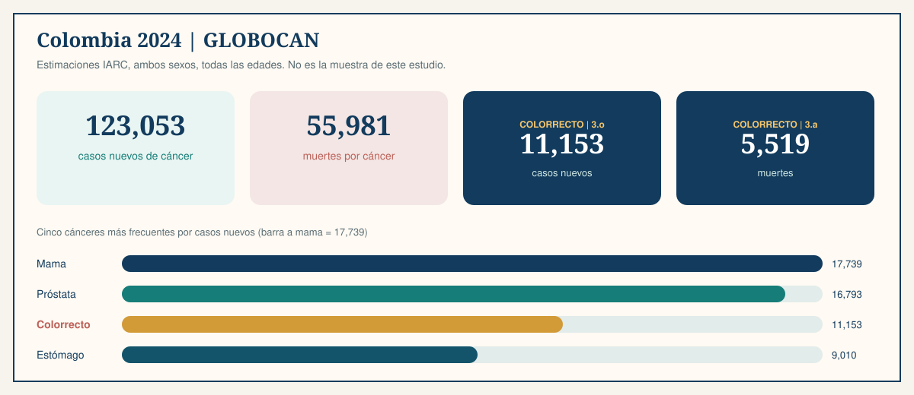{.plate fig-alt="Cifras GLOBOCAN 2024 de Colombia con el cáncer colorrectal destacado"}

<p class="lede">Estimaciones IARC, ambos sexos, todas las edades. Son cifras nacionales, no la muestra de este proyecto. Explican por qué existe un estudio colombiano de colitis y CCR.</p>

::: notes
No presentarlas como resultados del estudio. Fuente: ficha IARC de Colombia 2024.
:::

## La colitis ulcerativa es mucosa, crónica y no es Crohn

::: {.split}
::: {.visual}
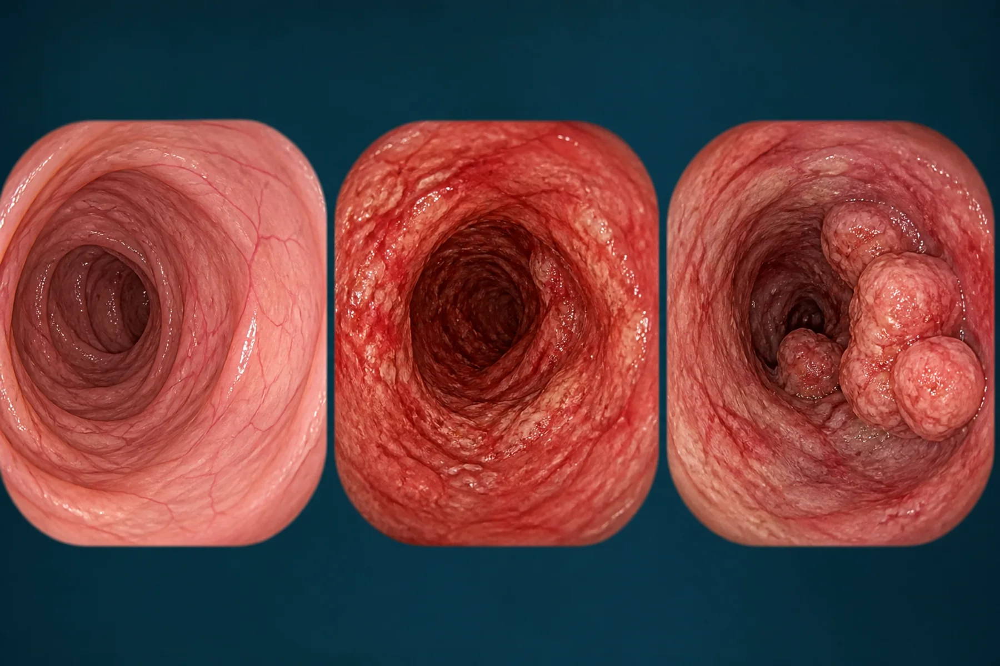{fig-alt="Vistas ilustrativas de mucosa sana, colitis ulcerativa y cáncer colorrectal"}
:::
::: {.copy}
<p class="lede">La <strong>colitis ulcerativa (CU)</strong> es inflamación crónica de la mucosa colónica. Sangre en heces, diarrea, urgencia y dolor abdominal son frecuentes. La extensión y la actividad varían.</p>

::: {.card .card-teal}
<h3>Qué es</h3>

Inflamación mucosa continua que, en la enfermedad típica, empieza en el recto. Curso con recaídas.
:::

::: {.card .card-coral}
<h3>Qué no es</h3>

No es Crohn. Este protocolo excluye Crohn, cirugía colónica previa y contraindicación de colonoscopia o biopsia.
:::

::: {.card .card-gold}
<h3>Por qué aparece el umbral de ocho años</h3>

La vigilancia AGA/ECCO suele empezar ~8–10 años tras el inicio, o antes con colangitis esclerosante primaria. Es un **umbral de vigilancia**, no un reloj que dice que el cáncer llega en el año ocho.
:::
:::
:::

## La progresión es posible. No es el camino por defecto.

::: {.split .split-wide}
::: {.visual}
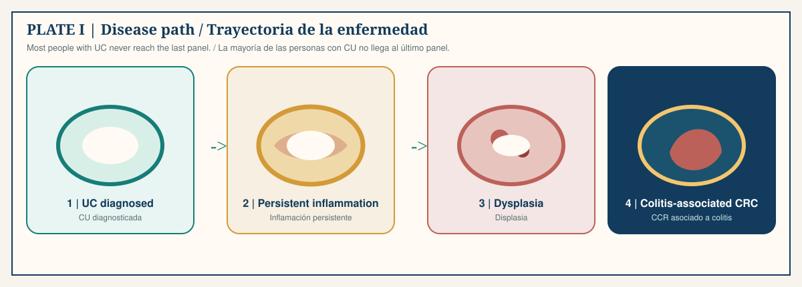{.plate fig-alt="Cuatro etapas: CU, inflamación persistente, displasia, CCR asociado a colitis"}
:::
::: {.copy}
<p class="lede">La mayoría de las personas con CU nunca entra en displasia ni en CCR asociado a colitis. La vigilancia colonoscópica sigue siendo el eje clínico. Este proyecto no la reemplaza. Pregunta si las moléculas de sangre y tejido añaden una segunda capa biológica.</p>

::: {.card .card-ocean}
<h3>La capa de investigación</h3>

cfDNA plasmático, metilación de tejido colónico y sIgA sérica pareados: se leen juntos, no como prueba diagnóstica.
:::
:::
:::

::: notes
90 segundos. La mayoría nunca llega al panel 4.
:::

## Comprobación 1

::: {.split}
::: {.visual}
{fig-alt="Vistas de colon usadas como pista para la primera comprobación"}
:::
::: {.copy}
::: {.check}
<p class="check-q">La mayoría de las personas con colitis ulcerativa desarrollan cáncer colorrectal.</p>

::: {.check-options}
::: {.opt}
A · Verdadero
:::
::: {.opt}
B · Falso
:::
:::
:::

::: {.fragment .answer .answer-no}
**Falso.** La CU extensa de larga duración eleva el riesgo. La mayoría nunca entra en displasia ni en CCR asociado a colitis. La vigilancia existe porque el cáncer es posible, no porque sea lo típico.
:::
:::
:::

## La metilación del ADN es una marca química, no una mutación

<span class="clock">3 min</span>
<p class="kicker">Acto 2 · Dos lenguajes moleculares</p>

::: {.split .split-wide}
::: {.visual}
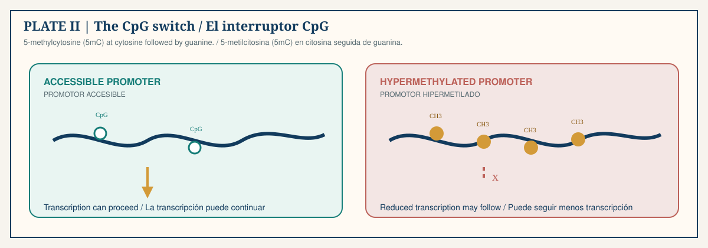{.plate fig-alt="Promotor accesible frente a promotor hipermetilado con marcas CH3"}
:::
::: {.copy}
<p class="lede">Un secuenciador lee **C** tenga o no un grupo metilo. La biología está en esa marca extra: **5-metilcitosina (5mC)**, casi siempre en un **CpG** (citosina y luego guanina en la misma hebra).</p>

::: {.chip-row}
<span class="chip">hipermetilación = más 5mC</span>
<span class="chip">hipometilación = menos 5mC</span>
<span class="chip">silenciado = 5mC del promotor + ARN bajo, medidos juntos</span>
:::

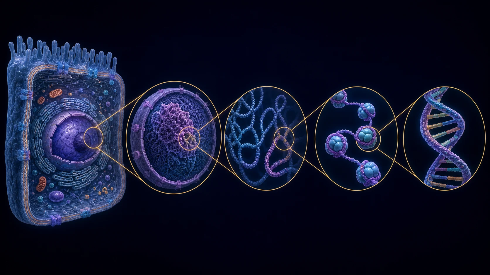{.plate-photo fig-alt="Empaquetamiento del ADN en el núcleo celular"}
:::
:::

## Los genes candidatos son hipótesis, no la enfermedad

::: {.split}
::: {.visual}
{fig-alt="Vías inmunes, epiteliales y de regulación génica dibujadas como red"}
:::
::: {.copy}
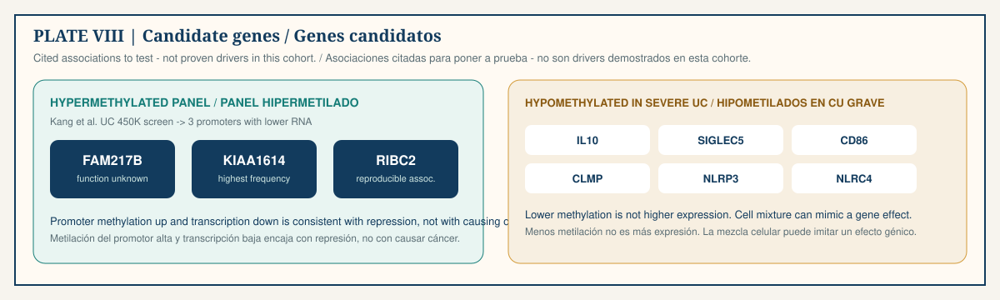{.plate fig-alt="Panel FAM217B, KIAA1614, RIBC2 y genes inmunes hipometilados"}

::: {.card .card-ocean}
<h3>También alrededor de la neoplasia en CU</h3>

`CDKN2A` / p16, `CDH1` (E-cadherina), `FOXE1` / `SYNE1`.
:::

::: {.card .card-coral}
<h3>Cómo debe ponerlos a prueba este proyecto</h3>

Conservar conteos metilados y totales. Usar DSS. Exigir CpGs coherentes en una región. Comparar tejido con plasma pareado. Ajustar por inflamación y mezcla celular.
:::
:::
:::

## La IgA secretora es un anticuerpo de frontera mucosa

::: {.split}
::: {.visual}
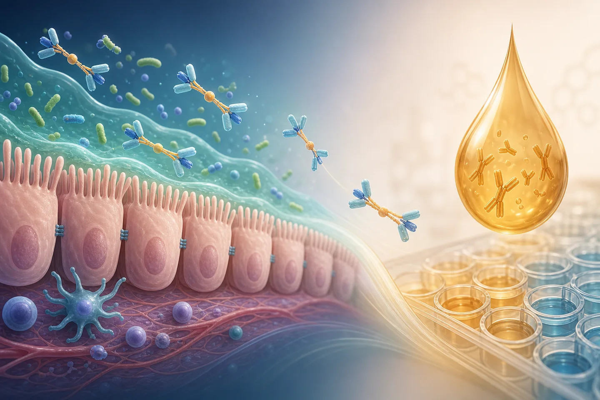{fig-alt="Epitelio intestinal, IgA secretora, gota de suero y pocillos de ELISA"}
:::
::: {.copy}
<p class="lede">La <strong>sIgA</strong> une microbios y antígenos en superficies húmedas y limita el contacto epitelial sin convertir cada encuentro en inflamación.</p>

<p class="lede">Este estudio mide **sIgA sérica por ELISA**, calibración 1,250–0 µg/ml en la corrida presentada ($R^2=0,959$). Ese $R^2$ es desarrollo del ensayo, no aceptación de placa. Blancos, recuperación, CV de réplicas, LLOQ/ULOQ y paralelismo siguen decidiendo si un número es usable.</p>

::: {.rule}
El suero no es heces, no es moco, no es recubrimiento luminal. No reportes un valor sérico como secreción intestinal.
:::
:::
:::

## Las dos señales responden preguntas distintas

::: {.split}
::: {.visual}
{fig-alt="Señales de metilación, fragmentación, inmunidad y estadística convergen en una huella"}
:::
::: {.copy}
::: {.card .card-teal}
<h3>Metilación del ADN</h3>

Estado epigenético e identidad celular. cfDNA plasmático + tejido colónico. Lectura de CpG/región. Alta dimensión. Falla con lote, mezcla celular y origen tisular mixto.
:::

::: {.card .card-gold}
<h3>sIgA sérica</h3>

Inmunidad humoral mucosa. Concentración por ELISA en suero. Un número interpretable. Falla con infección, fármacos, producción sistémica y aclaramiento.
:::

<p class="lede">La integración prueba si el **patrón conjunto** separa CU, CCR y grupos sanos mejor que cada marcador solo. Eso sigue siendo asociación, no una prueba diagnóstica.</p>
:::
:::

## Comprobación 2

::: {.split}
::: {.visual}
{fig-alt="Tres corrientes de datos de un mismo participante"}
:::
::: {.copy}
::: {.check}
<p class="check-q">Empareja la medición con el espécimen.</p>

::: {.check-options}
::: {.opt}
A · El EM-seq de plasma lee la concentración de sIgA sérica.
:::
::: {.opt}
B · El ADN de tejido se deja sin fragmentar para leer la fragmentómica del colon.
:::
::: {.opt}
C · Metilación de cfDNA plasmático, metilación de tejido y sIgA ELISA sérica salen de una misma persona.
:::
:::
:::

::: {.fragment .answer .answer-yes}
**C.** EM-seq es química de ADN, no un ensayo de anticuerpos. El ADN de tejido se **fragmenta a propósito**; solo los fragmentos nativos de plasma pueden sostener fragmentómica.
:::
:::
:::

## La pregunta que sostiene esta subvención

<span class="clock">2 min</span>
<p class="kicker">Acto 3 · Este estudio</p>

::: {.split}
::: {.visual}
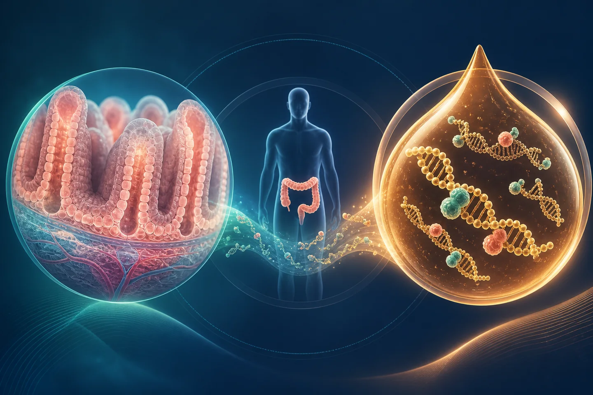{fig-alt="Tejido colónico y cfDNA plasmático pareados en un participante"}
:::
::: {.copy}
<p class="lede">¿Puede la metilación diferencial en **cfDNA plasmático** y **tejido colónico**, leída junto con **sIgA sérica** y marcadores de inflamación, ayudar a caracterizar la CU de alto riesgo frente a CCR y comparadores sanos?</p>

::: {.metric-row}
::: {.metric}
**PCI-2024-0016**
<span>código del proyecto</span>
:::
::: {.metric}
**18**
<span>participantes con consentimiento</span>
:::
::: {.metric}
**36**
<span>especímenes de ADN pareados</span>
:::
::: {.metric}
**3**
<span>grupos clínicos</span>
:::
:::

<p class="lede">Liderazgo operativo: **Angie Alejandra Benavides Rojas**. Asesora: **Dra. Sandra Perdomo**. Coasesora: **Dra. María Consuelo Romero**. Grupo: **InMubo**.</p>
:::
:::

## El pareo es dentro de una persona, no entre grupos

::: {.split .split-wide}
::: {.visual}
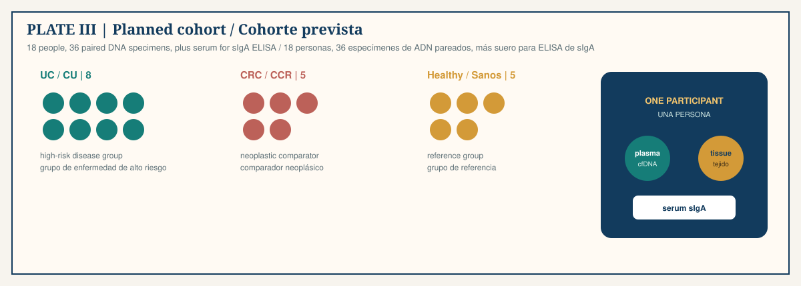{.plate fig-alt="Ocho participantes con CU, cinco con CCR y cinco sanos, con plasma, tejido y suero pareados"}
:::
::: {.copy}
<p class="lede">Elegibilidad de CU: CU confirmada **>8 años** o **colangitis esclerosante primaria**. Sedes: Cobos Medical Center, HIC Bucaramanga, GastroAdvanced.</p>

<p class="lede">Ética: **Resolución 8430 de 1993**; comité HIC Bucaramanga–Fundación Cardiovascular, **Acta 005-2024**. El git público permanece desidentificado. En este repositorio no hay datos clínicos ni genómicos a nivel de participante.</p>

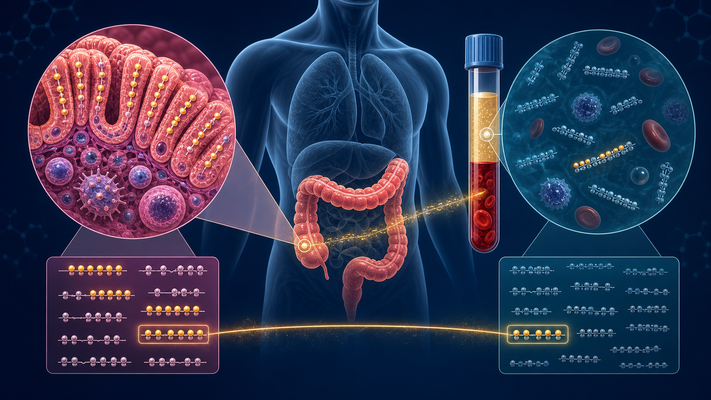{.plate-photo fig-alt="Metilación de tejido y plasma conectadas como un puente"}
:::
:::

## Qué puede afirmar este diseño — y qué no

::: {.split}
::: {.visual}
{fig-alt="Señales que entran en una huella analítica"}
:::
::: {.copy}
::: {.claims}
::: {.claim .claim-1 .claim-now}
**1 · Asociación**
<p>Las señales varían juntas en estas 18 personas. Este diseño puede probarlo.</p>
:::
::: {.claim .claim-2 .claim-now}
**2 · Discriminación**
<p>Un modelo separa grupos predefinidos en datos reservados: solo con rasgos fijos y remuestreo honesto.</p>
:::
::: {.claim .claim-3}
**3 · Pronóstico**
<p>Predice progresión futura. Requiere seguimiento longitudinal. No es este corte transversal.</p>
:::
::: {.claim .claim-4}
**4 · Utilidad clínica**
<p>Usar el modelo mejora la atención frente a la vigilancia por colonoscopia. Fuera de alcance.</p>
:::
:::
:::
:::

::: notes
Este estudio vive en los peldaños 1 y 2.
:::

## Sangre, biopsia, enzimas, secuenciador, placa

<span class="clock">3 min</span>
<p class="kicker">Acto 4 · Herramientas</p>

::: {.split .split-wide}
::: {.visual}
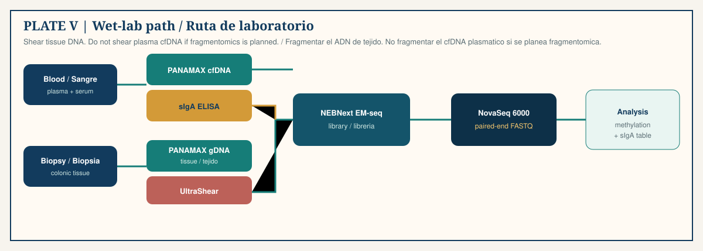{.plate fig-alt="Ruta de sangre y biopsia por PANAMAX, EM-seq, NovaSeq y ELISA"}
:::
::: {.copy}
| Etapa | Instrumento | Pregunta de paso |
|---|---|---|
| cfDNA plasmático | PANAMAX 48 | ¿Rendimiento sin fallo sesgado por grupo? |
| ADNg de tejido | PANAMAX 48 → UltraShear | ¿Fragmentación documentada? |
| Librería de metiloma | NEBNext EM-seq | ¿Pasan los controles de conversión? |
| Secuenciación | NovaSeq 6000, paired-end | ¿Profundidad e identidad usables? |
| sIgA | ELISA en suero | ¿Réplicas dentro del rango? |

{.plate-photo fig-alt="Nucleosomas a través de EM-seq hasta lecturas pareadas"}
:::
:::

::: notes
El plasma no se fragmenta. El tejido sí.
:::

## Por qué EM-seq y no bisulfito

::: {.split}
::: {.visual}
{fig-alt="Secuenciación enzimática de metilación a partir de ADN protegido por nucleosomas"}
:::
::: {.copy}
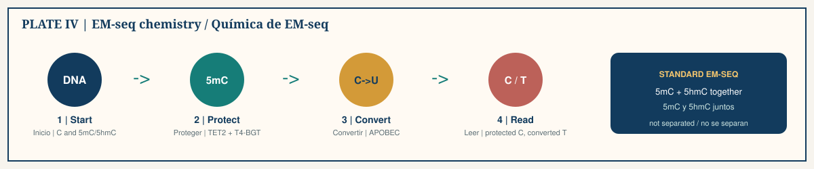{.plate fig-alt="EM-seq: proteger con TET2 y T4-BGT, convertir con APOBEC, leer C frente a T"}

<p class="lede">El bisulfito convierte citosinas no modificadas pero daña el ADN. El cfDNA plasmático ya es escaso y corto. EM-seq usa **TET2 + T4-BGT** para proteger 5mC/5hmC y luego **APOBEC** para desaminar la C no modificada, que se secuencia como T.</p>

::: {.rule}
El EM-seq estándar reporta 5mC y 5hmC **juntos**. Escribe «citosina modificada» a menos que un segundo ensayo los separe.
:::
:::
:::

## La fragmentómica es una segunda capa de la misma librería de plasma

::: {.split}
::: {.visual}
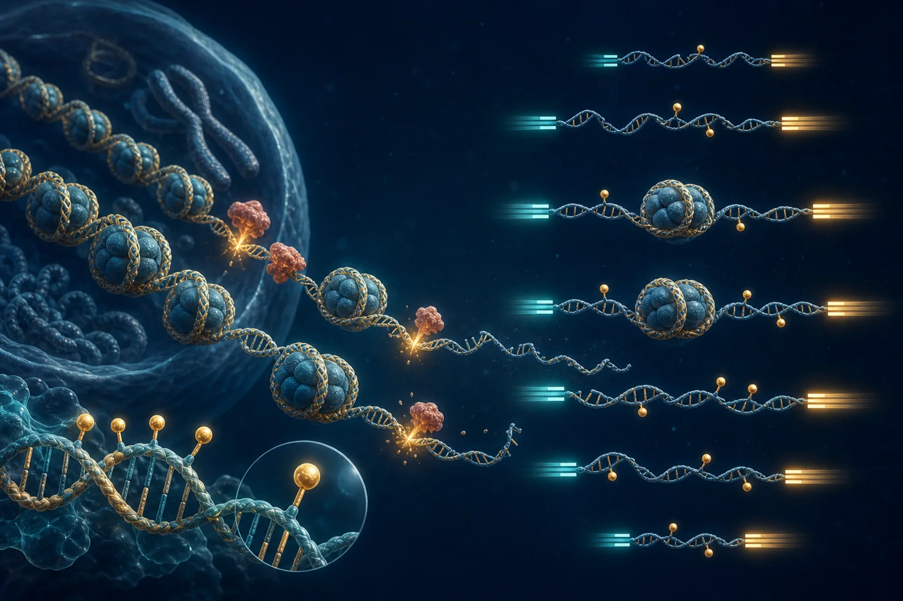{fig-alt="Fragmentos de cfDNA protegidos por nucleosomas y lecturas pareadas"}
:::
::: {.copy}
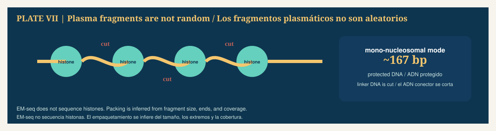{.plate fig-alt="ADN enrollado en histonas cortado en el ADN conector, modo mononucleosomal cerca de 167 pb"}

<p class="lede">De un BAM pareado de plasma puedes recuperar **longitud**, **extremos**, **motivos de extremo** y **cobertura regional**. Las histonas no se secuencian; el empaquetamiento se infiere.</p>

<p class="lede">Es una **extensión de factibilidad**. Muere si el plasma se fragmentó, no se retuvieron los tamaños de inserto, la profundidad es baja o el sesgo de conversión no está controlado.</p>
:::
:::

## Del FASTQ a una región que puedes nombrar

::: {.split}
::: {.visual}
{fig-alt="Ilustración de análisis de metilación consciente de los conteos"}
:::
::: {.copy}
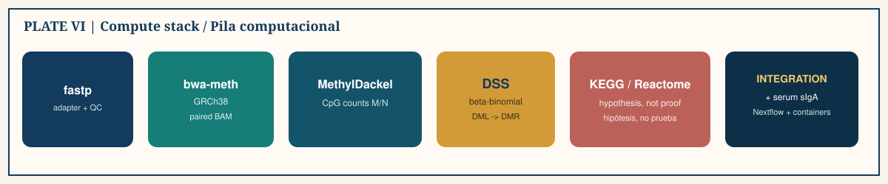{.plate fig-alt="fastp, bwa-meth, MethylDackel, DSS, KEGG/Reactome, integración"}

<p class="lede">En un CpG los datos son lecturas metiladas $M$ de lecturas informativas $N$. 50% de 2 lecturas no es 50% de 100. **DSS** usa un modelo beta-binomial y luego une CpGs vecinos en **DMR**.</p>

::: {.card .card-gold}
<h3>Límite de interpretación</h3>

El enriquecimiento KEGG/Reactome es una hipótesis estructurada. Registra la regla de mapeo, el universo de fondo, la versión de la base y el FDR.
:::
:::
:::

## Comprobación 3

::: {.split}
::: {.visual}
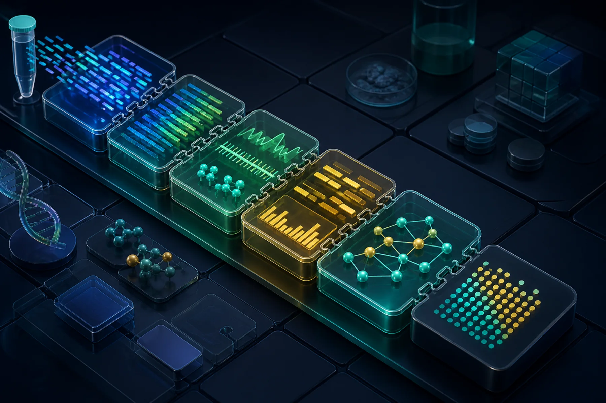{fig-alt="Pila de software para una huella de metilación y fragmentómica"}
:::
::: {.copy}
::: {.check}
<p class="check-q">Con 18 participantes, el producto cercano defendible es:</p>

::: {.check-options}
::: {.opt}
A · Un clasificador clínico que predice CU→CCR en un paciente nuevo.
:::
::: {.opt}
B · Un análisis de factibilidad con control de calidad y un conjunto pequeño y fijo de rasgos candidatos.
:::
::: {.opt}
C · Una prueba sanguínea multi-cáncer estilo Galleri para Colombia.
:::
:::
:::

::: {.fragment .answer .answer-yes}
**B.** Los clasificadores de alta dimensión, el pronóstico y el uso clínico necesitan validación longitudinal independiente. Galleri no está validada para vigilancia de progresión de CU.
:::
:::
:::

## Tu primera semana en este repositorio

<span class="clock">2 min</span>
<p class="kicker">Acto 5 · Cómo empezar</p>

::: {.split}
::: {.visual}
{fig-alt="Evolución del software de análisis de metilación"}
:::
::: {.copy}
```bash
python3 -m venv .venv && source .venv/bin/activate
python -m pip install -r requirements-quarto.txt
python -m ipykernel install --user --name project-python \
  --display-name "Python (methylation project)"
quarto preview
```

<p class="lede">El nombre de kernel `project-python` es obligatorio incluso para páginas solo de prosa.</p>

::: {.card .card-coral}
<h3>No subas</h3>

Datos clínicos o genómicos a nivel de participante, identificadores, consentimientos, claves de enlace.
:::

::: {.card .card-teal}
<h3>Contrato freeze</h3>

Tras cualquier edición a un documento R, vuelve a renderizar en local y sube `_freeze/`. CI no instala paquetes R.
:::
:::
:::

## Hoy, «listo» es una firma candidata, no una prueba {background-image="../media/illustrations/tissue-plasma-pairing.webp" background-opacity="0.12"}

::: {.split}
::: {.visual}
{fig-alt="Ilustración de vías para el cierre"}
:::
::: {.copy}
<p class="lede">Lee, en este orden: [diseño del estudio](../research.qmd), [EM-seq](../posts/what-is-emseq.qmd), [sIgA](../posts/what-is-siga.qmd), [tres corrientes de datos](../posts/three-data-streams-one-study.qmd), [genes candidatos](../posts/silenced-and-inflammatory-genes-in-colitis.qmd), [estadística](../posts/statistical-analysis-of-methylation-data.qmd), [contribuir](../contributing.qmd).</p>

<p class="lede">Luego toma el [cuestionario de 30 preguntas](../quiz.qmd).</p>

::: {.pause}
Frase de cierre: esta es una firma epigenética-inmune candidata con incertidumbre transparente — no una prueba diagnóstica.
:::
:::
:::

## Apéndice · Cadena de protocolos {visibility="uncounted"}

::: {.split}
::: {.visual}
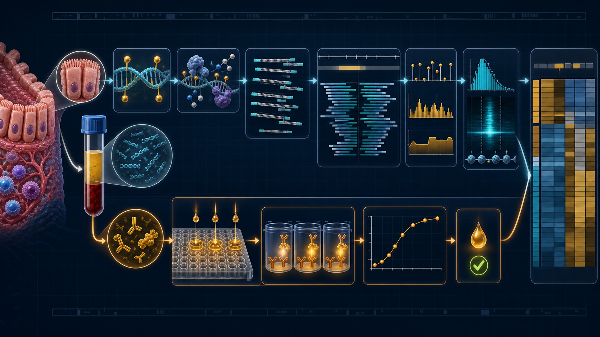{fig-alt="Alineamiento e integración en la tubería genómica"}
:::
::: {.copy}
::: {.small-list}
1. [Cohorte y consentimiento](../posts/protocol-cohort-and-consent.qmd)
2. [Procesamiento de sangre](../posts/protocol-blood-processing.qmd)
3. [Biopsia colónica](../posts/protocol-colonic-biopsy-preparation.qmd)
4. [PANAMAX cfDNA](../posts/protocol-panamax-cfdna.qmd)
5. [PANAMAX ADN genómico](../posts/protocol-panamax-genomic-dna.qmd)
6. [UltraShear](../posts/protocol-ultrashear-fragmentation.qmd)
7. [Librerías EM-seq](../posts/protocol-emseq-library-preparation.qmd)
8. [NovaSeq 6000](../posts/protocol-novaseq-6000.qmd)
9. [ELISA de sIgA](../posts/protocol-siga-elisa.qmd)
:::
:::
:::
