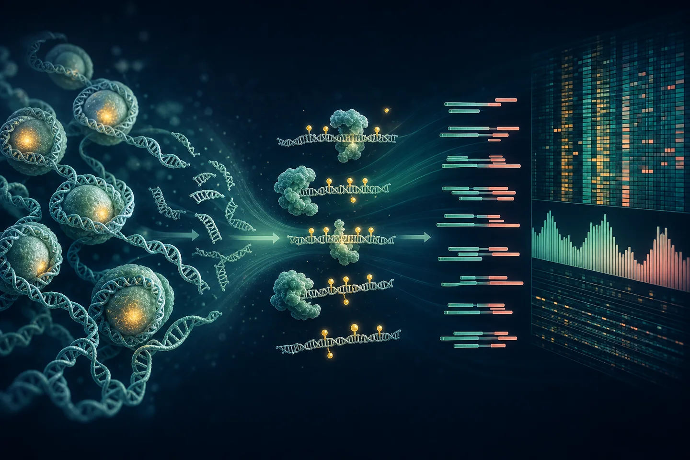

::: {.lead-panel}
## One library, two related layers of information

The plasma EM-seq library can describe **which cytosines were methylated** and—if native cfDNA fragment geometry is preserved—**how the DNA molecules were fragmented**. These layers are related because DNA methylation, nucleosome packaging, chromatin accessibility, cell death, and nuclease activity all influence the molecules released into plasma [@lo2021fragmentomics].
:::

{.science-visual fig-alt="Scientific illustration showing nucleosomes, enzymatic methyl sequencing, paired sequencing reads, and analytical profiles"}

## What is actually sequenced?

The sequencer reads both ends of short DNA molecules in an EM-seq library. For each paired-end plasma molecule, the analysis may recover:

| Observable | Derived from | Biological layer |
|---|---|---|
| Read sequence and genomic position | Bases and alignment to GRCh38 | Genomic origin of the molecule |
| Cytosine state | Enzymatic conversion followed by sequencing | 5mC/5hmC protection versus unmodified cytosine conversion |
| Fragment length | Distance and orientation of a properly paired alignment | Size distribution and nucleosomal periodicity |
| Fragment ends | Left/right genomic coordinates and terminal sequence motifs | Chromatin- and nuclease-associated cleavage patterns |
| Regional coverage | Counts of overlapping fragments | Genome-wide representation and footprints near regulatory regions |

Fragmentomics does **not** sequence a separate molecule type. It reuses positional and physical information carried by paired-end reads from native plasma cfDNA. Tissue genomic DNA is deliberately sheared for library preparation, so its insert lengths describe the laboratory fragmentation step and should not be interpreted as native tissue fragmentomics.

## Why histones matter

DNA in the nucleus is wrapped around histone proteins to form nucleosomes. During cell death and DNA release, nucleosome-protected DNA is less accessible to nucleases than linker DNA. Plasma cfDNA therefore often shows a mono-nucleosomal mode near 167 bp and longer multiples, plus coverage and end-position patterns related to chromatin organization [@lo2021fragmentomics].

```{mermaid}
flowchart LR
  C["Cell nucleus"] --> N["DNA wrapped around<br/>histone nucleosomes"]
  N --> D["Cell death +<br/>nuclease cleavage"]
  D --> F["Protected cfDNA<br/>fragments in plasma"]
  F --> L["Length + ends +<br/>coverage footprints"]
  F --> M["Methylation state<br/>along the fragment"]
  L --> I["Joint biological<br/>interpretation"]
  M --> I
```

Histones are not directly sequenced by EM-seq. Their organization is inferred indirectly from patterns in DNA fragment size, positions, and coverage. This inference can be altered by collection delay, nuclease activity, extraction, end repair, conversion, PCR, sequencing depth, and mapping.

## How methylation and fragmentation connect

Methylation is associated with chromatin state, and cleavage near CpGs can differ with methylation configuration. FRAGMA demonstrated methylation-aware CpG cleavage profiles [@zhou2022fragma], while FinaleMe used fragment length, coverage, and CpG position within a fragment to infer methylation from plasma WGS [@liu2024finaleme]. These papers justify testing linked features, but their trained models are not automatically valid for this EM-seq protocol or UC cohort.

## NEBNext EM-seq wet-lab logic

NEBNext Enzymatic Methyl-seq avoids the harsh bisulfite reaction and supports low-input, fragmented DNA [@vaisvila2021emseq]. In simplified terms:

1. **Prepare the DNA library.** Preserve native plasma cfDNA; shear tissue DNA in a controlled, documented step.
2. **Protect modified cytosines.** TET2 oxidation and T4-BGT chemistry protect 5mC and 5hmC from the later deamination step.
3. **Convert unmodified cytosines.** APOBEC deaminates unmodified cytosine so it is read as thymine after amplification and sequencing.
4. **Sequence paired ends.** Illumina reads retain methylation information and, for plasma, the paired alignment needed to estimate insert length and ends.

::: {.callout-note title="What the assay reports"}
Standard EM-seq readout generally represents protected 5mC and 5hmC together rather than separating them. Interpret it as modified-cytosine signal unless an additional assay distinguishes the two.
:::

## Genomics pipeline

```{mermaid}
flowchart TD
  R["Paired FASTQ"] --> Q["fastp<br/>adapter + quality QC"]
  Q --> A["bwa-meth<br/>alignment to GRCh38"]
  A --> B["Coordinate-sorted BAM<br/>pair + insert QC"]
  B --> MC["MethylDackel<br/>CpG methylation calls"]
  MC --> DS["DSS<br/>DML/DMR models"]
  DS --> PA["Gene mapping +<br/>KEGG/Reactome pathways"]
  B --> FR["Fragment feature table<br/>lengths, ends, TSS coverage"]
  MC --> JM["Methylation × length<br/>joint summaries"]
  FR --> JM
  PA --> IN["Integrated model"]
  JM --> IN
  S["sIgA + inflammation<br/>+ clinical covariates"] --> IN
```

### Minimum outputs and checks

| Stage | Required output | Stop/go question |
|---|---|---|
| FASTQ QC | Read counts, base quality, adapter content, duplication indicators | Is the library usable without differential quality by group? |
| Alignment | Mapping rate, proper-pair rate, duplicates, conversion controls, insert sizes | Are positions, methylation calls, and native plasma sizes credible? |
| Methylation | Coverage distribution, conversion performance, CpG calls | Is coverage sufficient and comparable for DML/DMR modeling? |
| Fragmentomics | Length distribution, short ratio, nucleosomal peaks, ends, TSS coverage | Was native fragment structure preserved and is depth adequate? |
| Integration | Locked feature table with batch and clinical covariates | Can uncertainty be estimated without feature leakage or overfitting? |

## Pathway interpretation

After FDR-controlled DML/DMR analysis, mapped genes can be summarized with [KEGG](https://www.genome.jp/kegg/pathway.html) and [Reactome](https://reactome.org/PathwayBrowser/). The report should retain the CpG/DMR-to-gene rule, tested-region background, database version, effect direction, overlap size, and adjusted p-value. Enrichment is a structured hypothesis about biological context—not direct evidence that a pathway is active.

::: {.callout-important title="Critical boundary"}
With 18 planned participants, the defensible target is a quality-controlled feasibility analysis and a small set of candidate features. High-dimensional classifiers, prognosis claims, and clinical use require independent longitudinal validation.
:::

[See the complete experimental roadmap →](roadmap.qmd) · [Read the annotated papers →](publications.qmd)

## References

::: {#refs}
:::
